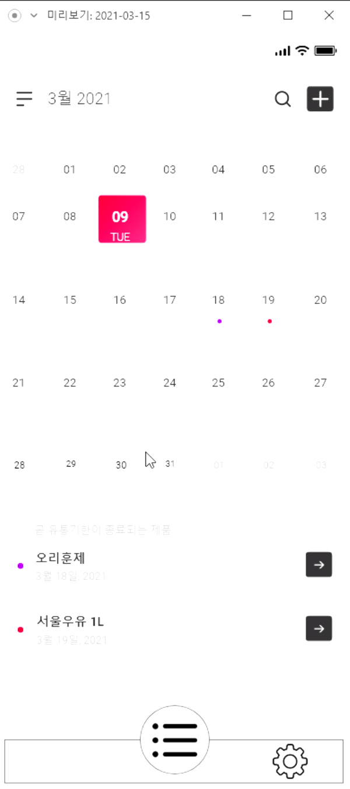
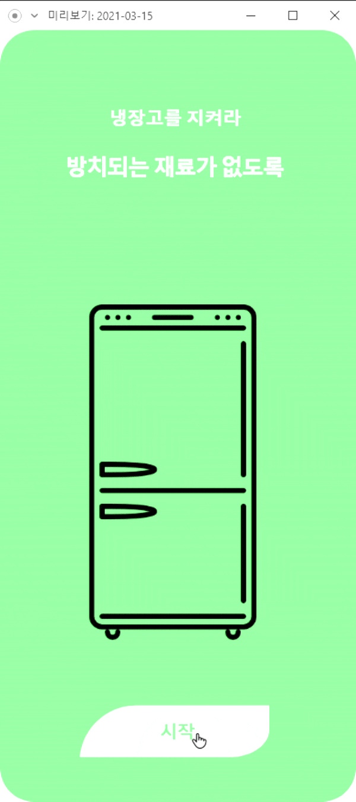

# 냉장고를 지켜라!

**팀페이지 주소** -> [https://github.com/kookmin-sw/capstone-2021-2021-9](https://github.com/kookmin-sw/capstone-2021-2021-9)

**관련 자료** -> [https://drive.google.com/drive/folders/1V2mzOw_bEXJdegS4G252FB-DH29KiUCr?usp=sharing](https://drive.google.com/drive/folders/1V2mzOw_bEXJdegS4G252FB-DH29KiUCr?usp=sharing)

### 1. 프로잭트 소개

프로젝트 명: 냉장고를 지켜라(가제)
플랫폼: 모바일 어플리케이션(IOS/안드로이드)
타겟 소비자: 주부, 자취생, 식품 관리를 해야하는 자영업자, 건망증이 심한 사람

**주요 기능**

1. 현재 소유하고 있는 식품을 리스트로 정리
2. 정리되어 있는 식품들의 유통기한이 임박하였을 시, 알림 기능
3. 영수증 텍스트 인식을 통해 식품들 리스트로 정리하는데 편의성 제공
4. 온라인 쇼핑몰 구매목록 인식을 통해 리스트로 정리하는데 편의성 제공
5. 제품에 프린트 되어있는 유통기한 인식을 통해 유통기한 입력에 대한 편의성 제공

<h1>Multiple Upload with preview and order</h1>
<div class="block">
  <label class="button" for="images">Upload Images</label>
  <input type="file" id="images" multiple="multiple"/>
  <div id="multiple-file-preview">
    <ul id="sortable">
      <div class="clear-both"></div>
    </ul>
  </div>
</div>


**유사 제품**

- Freeasy
- BEEP
- 유통기한 언제지?

### 팀 소개

- 전현근(20153224/팀장)


```
프로젝트 매니징
```

- 김민주(20163091)


```
안드로이드 어플리케이션 개발
```

- 김찬민(20163101)


```
IOS 어플리케이션 개발
```

- 박하윤(20163111)


```
핵심 기능(기술) 개발
```
